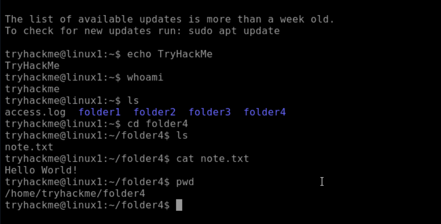

# Linux Fundamentals part 1

## Introduction
* This room is about linux fundamentals it gives a little background about linux and when its operating system was released.
* It teaches essential commands and symbolic operators or shell operators used to interact with the file system.
* Also it gives Insight on how to navigate the file system using command lines.

## Objective 
* The purpose of this lab is to make us more familiar with linux and linux commands.
* after learning this one can tell what commands to use to navigate through files, tell its location and view the contents of files.

## Prerequisites
* This room is designed for complete beginners who have no knowledge about linux and its command lines.
* The only requirement was a computer or desktop.

## What I Learned 
* Even though we think we can't adapt linux and think that its hard in fact it's the easiest operating system to learn.
* The followings are Commands i learned on this room that helps to interact with the file system.
1. #### echo
   * The 'echo' command displays the text we provide
     ```
     echo text
     ```
2. #### whoami
   * The 'whoami' tells us what our user name is or what user we are logged in as
     ```
     whoami
     ```
3. #### ls
   * The 'ls' is used when we want to list all files and folders
     ```
     ls
     ```
4. #### cd
   * The 'cd' is used to change directory
     ```
     cd filename
     ```
5. #### cat
   * The 'cat' is used display file contents
     ```
     cat filename
     ```
6. #### pwd
   * The 'pwd' is used to show where you currently are
     ```
     pwd
     ```
7. #### find
   * The 'find' command is used in two different ways
     
   A, The first one when we know the name of the file but don't know where its found
     ```
     find -name filename
     ```
   B, The second one is when we don't know the name of the file we are looking for but know what type of file it is
      ```
      find -name *.txt
      ```
8. #### grep
   * The 'grep' command allows us to search the contest for files for specific values that we are looking for
     ```
     grep "hello" filename.txt
     ```
9. #### &
    * The '&' operator allow other commands in the background to operate
10. #### &&
    * The '&&' is used to make list of commands run but the catch is command 2 runs when command 1 was successful.
11. #### >
    * This operator is known as output redirector
    * This '>' is used when we to copy a text onto another file or transfer it
    * This will overwrite it even if there was another file
      ```
      echo hello > new folder
      ```
12. #### >>
    * This is also an output redirector
    * '>>' is different form '>' because it doesn't overwrite anything it just adds it
      ```
      echo hello >> new folder
      ```
      
  ## conclusion
  * This rooms gives a great introduction for anyone just started learning linux 
