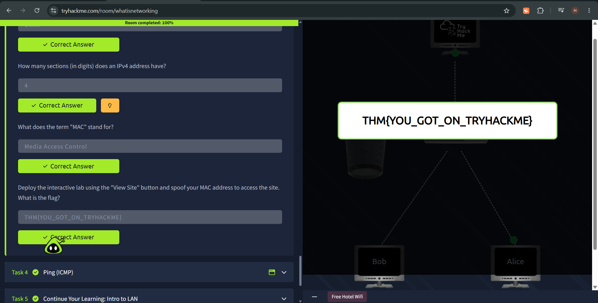
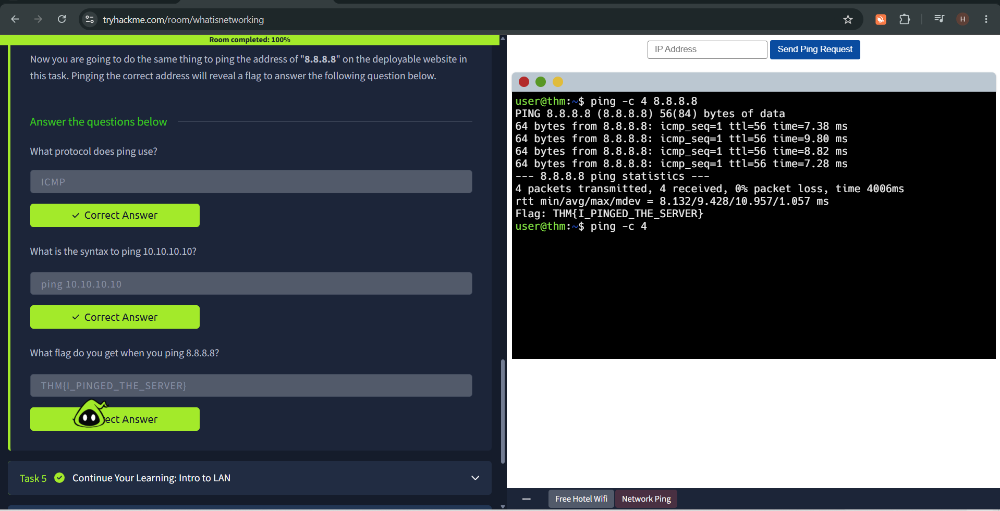

# What is Networking

## Introduction

* This room is all about networking, internet, how devices are identified in a network
* How to use ping command and its use 
* This room also contains 2 flags

## Objective 

* The purpose of this room to teach us about networking how it works
* How internet is
* How to check if two devices are connected
* It also have a practical challenge on how to spoof mac address

## Prerequisites

* This room is designed for complete beginners who have no knowledge about networking and how it works.
* The only requirement was a computer or desktop.

## What I Learned

#### 1. What is a Network?

* Network is just simply devices connected together it can be 2 devices or billions
* They can come in all size, shape and type

#### 2. The Internet
* The Internet is a giant network or when many networks came together they for the Internet.
* It was invented by Tim Berners-Lee by the creation of the _World Wide Web (WWW)_.
* On the internet there are two type of networks private and public networks this determines type of Ip Address they have
  
  ##### A, A public network : it connects the private networks
  ##### B. A private network : when small networks connect


#### 3. Identifying Devices on a Network
* Before connecting to devices first we need to identify them.
* There are two means to identify devices
  
  ##### A. An IP Addresses (internet protocol)
  * Ip address is divided in 4 octet and each one can be between number 0-255
  * They change from device to device but two devices cant have the same Ip Address
  * We have two type of addresses based on the type of network they are in
     1. Public address : is used to identify the device on the internet 
     2. Private address : it identifies a device amongst other devices
  * Devices on the same local network use their private IP addresses to communicate with each other
  * IPv4 uses a number system and have 2^32 Ip Addresses
  * IPv6 uses number, letters etc.. and have 2^128 Ip Addresses
  * IPv6 came because IPv4 was running out

  ##### B MAC Addresses
  * All devices on the network have their own physical network interface its called MAC
  * MAC is given his address by the factory it's a twelve-character hexadecimal number its separated by colon into to two
  * _EXAMPLE_:a4:c3:f0:85:ac:2d , a4:c3:f0: is represent the company that made the network interface and 85:ac:2d is a unique number
  * MAC addresses can be faked or spoofed using the spoofing process this can happen when the spoofer pretend as the guy who we are trying to connect to
    
    
    
#### 5. Ping
* It is the most fundamental network tool available and it uses ICMP (Internet Control Message Protocol) 
* We use when are trying to see if there is a connection between two devices also if its reliable
  ```
  ping IP Address
  ```
  

## Conclusion
* This rooms give a broad knowledge on networks internet and what's inside them and it's a great way to start learning about networking 
